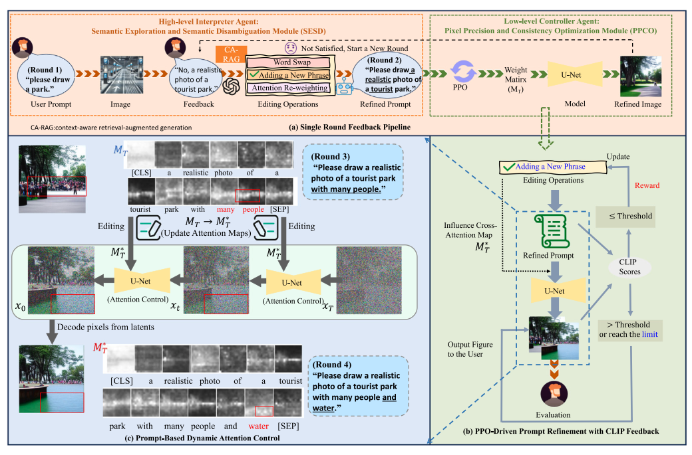
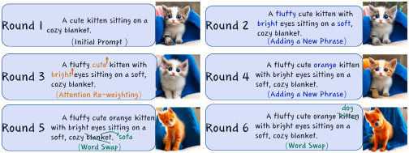
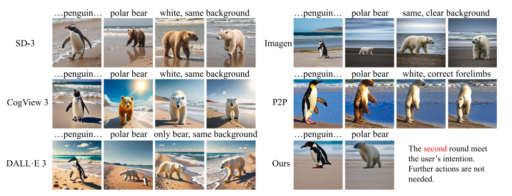

# Visual Co-Adaptation (VCA) for Ambiguous Prompts

Official repository for the paper:  
**"Enhancing intent understanding for ambiguous prompt: A human–machine co-adaption strategy"**  
*Neurocomputing*, Volume 646, 2025, 130415.  
DOI: [10.1016/j.neucom.2025.130415](https://doi.org/10.1016/j.neucom.2025.130415)

[](https://doi.org/10.1016/j.neucom.2025.130415)
[](https://huggingface.co/datasets/Kevin3777/Enhancing_Intent_Understanding)
[](LICENSE)
[](https://pytorch.org/)

---

## 📌 Overview

Text-to-Image (T2I) systems frequently encounter vague or polysemous natural language inputs (e.g., *"mouse"* could mean an animal or computer hardware; *"spring"* could mean a season or a water spring). 

<p align="center">
  
  <br>
  <em>Figure 1: Demonstration of disambiguation in text-to-image generation (e.g., jam, bat, spring, mouse).</em>
</p>

**Visual Co-Adaptation (VCA)** introduces a closed-loop human-in-the-loop framework combining:
1. **High-level Interpreter (SESD)**: Multi-turn prompt disambiguation and context-aware retrieval.
2. **Low-level Controller (PPCO)**: Pixel Precision and Consistency Optimization using Proximal Policy Optimization (PPO) and dynamic Cross-Attention matrix editing.

<p align="center">
  
  <br>
  <em>Figure 2: Overview of the VCA framework: (a) Single-round feedback pipeline, (b) PPO-driven prompt refinement with CLIP feedback, (c) Prompt-based dynamic attention control.</em>
</p>

---

## 📐 Mathematical Formulations & Core Implementation

### 1. Dual-Objective CLIP Reward Optimization (Section 3.2.1, Eq. 14)

To balance visual continuity with respect to the historical prompt while remaining responsive to new user feedback, the reward function $\mathcal{R}(\Theta)$ is formulated as:

$$\mathcal{R}(\Theta) = \text{CLIP}(I_{\text{gen}}, P_{\text{prev}}) + \lambda \cdot \text{CLIP}(I_{\text{gen}}, P_{\text{new}})$$

where $\lambda = 0.2$ serves as an empirically validated trade-off weight.

```python
import torch
import torch.nn as nn
from transformers import CLIPProcessor, CLIPModel
from PIL import Image

class CLIPRewardModel(nn.Module):
    """Computes composite reward R(Theta) according to Eq. (14)."""
    def __init__(self, device: str = "cuda", lambda_tradeoff: float = 0.2):
        super().__init__()
        self.device = device
        self.lambda_tradeoff = lambda_tradeoff
        self.model = CLIPModel.from_pretrained("openai/clip-vit-base-patch32").to(device)
        self.processor = CLIPProcessor.from_pretrained("openai/clip-vit-base-patch32")

    def compute_similarity(self, image: Image.Image, text: str) -> float:
        inputs = self.processor(text=[text], images=image, return_tensors="pt", padding=True).to(self.device)
        with torch.no_grad():
            outputs = self.model(**inputs)
            img_embeds = outputs.image_embeds / outputs.image_embeds.norm(dim=-1, keepdim=True)
            txt_embeds = outputs.text_embeds / outputs.text_embeds.norm(dim=-1, keepdim=True)
            similarity = torch.matmul(img_embeds, txt_embeds.T).item()
        return float(similarity)

    def forward(self, img_gen: Image.Image, p_prev: str, p_new: str) -> float:
        # Eq. (14)
        r_prev = self.compute_similarity(img_gen, p_prev)
        r_new = self.compute_similarity(img_gen, p_new)
        return r_prev + self.lambda_tradeoff * r_new
```

### 2. PPCO: PPO-based Attention Policy Update (Section 3.2.2, Eq. 20)

The low-level controller optimizes attention editing policies across iterations using Proximal Policy Optimization (PPO):

$$L^{\text{PPO}}(\theta) = \hat{\mathbb{E}}_t \left[ \min\left( \rho_t(\theta) \hat{A}_t, \text{clip}(\rho_t(\theta), 1-\epsilon, 1+\epsilon)\hat{A}_t \right) \right]$$

where $\rho_t(\theta) = \frac{\pi_\theta(a_t \mid s_t)}{\pi_{\theta_{\text{old}}}(a_t \mid s_t)}$ and the advantage function is $\hat{A}_t = r_t + \gamma V(s_{t+1}) - V(s_t)$.

```python
import torch.nn as nn
import torch.optim as optim

class PPCOTrainer:
    """Updates attention editing policy using clipped surrogate objective (Eq. 20)."""
    def __init__(self, policy_net, lr: float = 5e-5, clip_eps: float = 0.2):
        self.policy_net = policy_net
        self.clip_eps = clip_eps
        self.optimizer = optim.Adam(self.policy_net.parameters(), lr=lr)

    def train_step(self, states, actions, old_probs, rewards, values, next_values, gamma=0.99):
        # Advantage estimation: A_hat = r + gamma * V(s_{t+1}) - V(s_t)
        advantages = rewards + gamma * next_values - values
        advantages = (advantages - advantages.mean()) / (advantages.std() + 1e-8)

        action_probs, _, current_values = self.policy_net(states)
        cur_probs = action_probs.gather(1, actions.unsqueeze(-1)).squeeze(-1)
        
        # Policy probability ratio rho_t(theta)
        ratio = cur_probs / (old_probs + 1e-8)

        # Eq. (20): Clipped objective
        surr1 = ratio * advantages
        surr2 = torch.clamp(ratio, 1.0 - self.clip_eps, 1.0 + self.clip_eps) * advantages
        policy_loss = -torch.min(surr1, surr2).mean()
        value_loss = nn.MSELoss()(current_values.squeeze(-1), rewards + gamma * next_values)

        total_loss = policy_loss + 0.5 * value_loss
        self.optimizer.zero_grad()
        total_loss.backward()
        self.optimizer.step()
        return total_loss.item()
```

### 3. Dynamic Attention Control Strategies (Section 3.2.3, Eq. 21–30)

During diffusion sampling, cross-attention maps $M_t$ are intercepted and dynamically manipulated via three specialized operations:

- **Strategy A: Attention-Replace (Word Swap, Eq. 21)**  
  Preserves structural composition when swapping base tokens by limiting injection up to step $\tau$:
  $$\text{Edit}(M_t, M_t^*, t) := \begin{cases} M_t^* & \text{if } t < \tau \\ M_t & \text{otherwise} \end{cases}$$

- **Strategy B: Attention-Refine (Adding Phrase, Eq. 23, 27)**  
  Maintains layout while smoothly blending new tokens with existing tokens using alignment map $A(j)$ and adaptive mixing parameter $\beta_t$:
  $$M_{\text{update}}(t) = \beta_t \cdot M_{\text{orig}}(t) + (1 - \beta_t) \cdot M_{\text{new}}(t)$$

- **Strategy C: Attention-Reweight (Feature Scaling, Eq. 28)**  
  Controls the visual prominence of a specified token $j^*$ using scale parameter $c \in [-2, 2]$:
  $$(\text{Edit}(M_t, M_{t+1}, t))_{i,j} := \begin{cases} c \cdot M_t(i,j) & \text{if } j = j^* \\ M_t(i,j) & \text{otherwise} \end{cases}$$

```python
import torch

class DynamicCrossAttentionController:
    """
    Implements dynamic cross-attention editing (Eq. 21 - 30).
    Intercepts and modifies attention maps during the diffusion backward pass.
    """
    def __init__(self, tau: int = 15, beta: float = 0.5):
        self.tau = tau          # Threshold step for Attention-Replace (Eq. 21)
        self.beta = beta        # Blending factor for Attention-Refine (Eq. 27)
        self.cur_step = 0
        self.strategy = "none"
        self.params = {}
        self.orig_cache = {}

    def set_action(self, strategy: str, params: dict):
        self.strategy = strategy
        self.params = params

    def step(self):
        self.cur_step += 1

    def __call__(self, attn: torch.Tensor, is_cross: bool) -> torch.Tensor:
        if not is_cross:
            return attn

        # 1. Attention-Replace (Eq. 21)
        if self.strategy == "replace" and self.cur_step < self.tau:
            src_idx = self.params.get("source_idx")
            tgt_idx = self.params.get("target_idx")
            if src_idx is not None and tgt_idx is not None:
                attn[:, :, :, tgt_idx] = attn[:, :, :, src_idx]

        # 2. Attention-Refine (Eq. 27)
        elif self.strategy == "refine":
            mapper = self.params.get("token_mapper", {})
            if self.cur_step in self.orig_cache:
                orig_attn = self.orig_cache[self.cur_step]
                for old_idx, new_idx in mapper.items():
                    attn[:, :, :, new_idx] = (
                        self.beta * orig_attn[:, :, :, old_idx] +
                        (1.0 - self.beta) * attn[:, :, :, new_idx]
                    )

        # 3. Attention-Reweight (Eq. 28)
        elif self.strategy == "reweight":
            token_idx = self.params.get("target_token_idx")
            scale_c = self.params.get("scale_c", 1.0)
            scale_c = max(min(scale_c, 2.0), -2.0)  # Constrain c in [-2, 2]
            if token_idx is not None:
                attn[:, :, :, token_idx] = attn[:, :, :, token_idx] * scale_c

        return attn
```

<p align="center">
  
  <br>
  <em>Figure 3: Multi-round iterative prompt refinement showing the visual impact of Adding Phrases, Attention Re-weighting, and Word Swapping.</em>
</p>

---

## 📦 Multi-Round Dialogue Dataset

We contribute a fine-grained annotated multi-turn dialogue dataset consisting of 1,673 JSON records (~3,000 dialogue turns) covering 5 domains: Clothing, Natural scenes, Anime, Realism, and Others.

The dataset is publicly hosted on Hugging Face:  
🔗 [https://huggingface.co/datasets/Kevin3777/Enhancing_Intent_Understanding](https://huggingface.co/datasets/Kevin3777/Enhancing_Intent_Understanding)

```json
{
  "dialogue_id": "train_0421",
  "category": "Natural scenes",
  "initial_prompt": "A tranquil garden",
  "turns": [
    {
      "round": 1,
      "user_feedback": "with blooming flowers and a wooden bench",
      "clarified_prompt": "A tranquil garden with blooming flowers and a wooden bench",
      "operation": "Attention-Refine",
      "clip_score": 0.89,
      "user_satisfaction": 4.8
    }
  ]
}
```

---

## 🚀 Quick Start

### 1. Installation

```bash
git clone [https://github.com/Kevin3777/Enhancing-intent-understanding-for-ambiguous-prompt.git](https://github.com/Kevin3777/Enhancing-intent-understanding-for-ambiguous-prompt.git)
cd Enhancing-intent-understanding-for-ambiguous-prompt
pip install -r requirements.txt
```

`requirements.txt`:
```text
torch>=2.0.0
transformers>=4.30.0
diffusers>=0.20.0
accelerate>=0.20.0
pillow>=9.0.0
```

### 2. Run Interactive Co-Adaptation Pipeline

```python
import torch
from diffusers import StableDiffusionPipeline
from attention_control import DynamicCrossAttentionController
from ppco_rl import CLIPRewardModel

device = "cuda" if torch.cuda.is_available() else "cpu"

# 1. Load Pretrained T2I Pipeline
pipe = StableDiffusionPipeline.from_pretrained(
    "runwayml/stable-diffusion-v1-5", 
    torch_dtype=torch.float16 if device == "cuda" else torch.float32
).to(device)

controller = DynamicCrossAttentionController(tau=15)
reward_evaluator = CLIPRewardModel(device=device, lambda_tradeoff=0.2)

# 2. Round 1: Ambiguous Prompt
prompt_round_1 = "A mouse sitting on a desk"
image_r1 = pipe(prompt_round_1, num_inference_steps=30).images[0]
image_r1.save("round_1.png")

# 3. Round 2: Co-Adaptation using Attention-Reweight (Eq. 28)
# User clarifies intent to a glowing computer mouse
prompt_round_2 = "A glowing optical computer mouse sitting on a wooden desk"
controller.set_action("reweight", {"target_token_idx": 3, "scale_c": 1.6})

image_r2 = pipe(prompt_round_2, num_inference_steps=30).images[0]
image_r2.save("round_2.png")

# 4. Compute Reward (Eq. 14)
reward = reward_evaluator(image_r2, prompt_round_1, prompt_round_2)
print(f"Alignment Reward R(Theta): {reward:.4f}")
```

---

## 📊 Experimental Results

As reported in *Neurocomputing* 646 (2025):

- **Average Dialogue Rounds to Satisfaction**: Reduced from 6.9 (w/o RL) to 4.3 (with PPO).
- **Mean CLIP Score**: Reaches 0.92, significantly outperforming standard diffusion baselines.
- **User Satisfaction Rating**: Increased to 4.73 / 5.0.

<p align="center">
  
  <br>
  <em>Figure 4: Qualitative comparison showing VCA's ability to maintain context and background consistency across rounds compared to SD-3, Imagen, CogView 3, P2P, and DALL-E 3.</em>
</p>

---

## 📖 Citation

If you find this work or dataset helpful in your research, please cite our paper:

```bibtex
@article{wang2025enhancing,
  title={Enhancing intent understanding for ambiguous prompt: A human--machine co-adaption strategy},
  author={Wang, Yijin and He, Yangfan and Wang, Jianhui and Li, Kun and Sun, Li and Yin, Jun and Zhang, Miao and Wang, Xueqian},
  journal={Neurocomputing},
  volume={646},
  pages={130415},
  year={2025},
  publisher={Elsevier},
  doi={10.1016/j.neucom.2025.130415}
}
```
